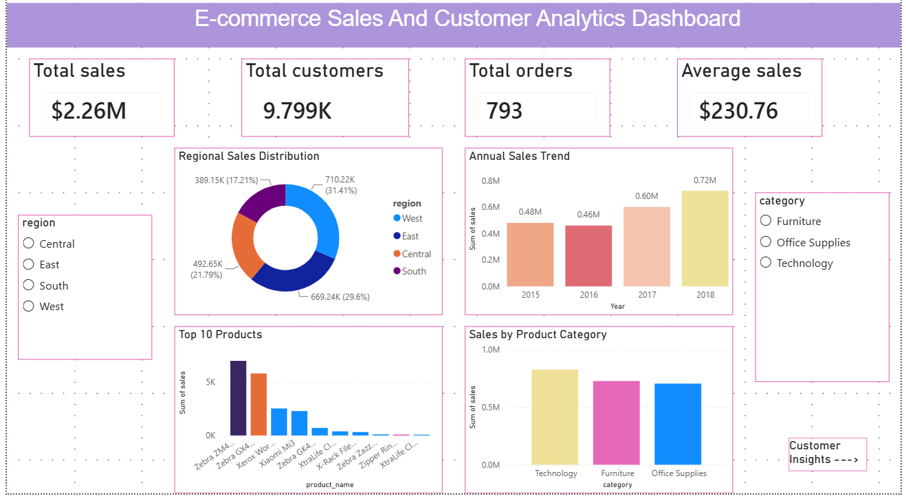

# 🛒 Ecommerce Sales & Customer Analytics Dashboard

## 📌 Project Overview

The Ecommerce Sales & Customer Analytics Dashboard is a Power BI project designed to analyze sales performance, customer behavior, and business trends. This dashboard helps businesses make data-driven decisions by providing interactive visualizations and key performance indicators (KPIs).

---

## 🎯 Objectives

- Monitor overall sales performance
- Analyze profit and revenue trends
- Identify top-performing products and categories
- Understand customer purchasing behavior
- Track monthly sales growth
- Support business decision-making through data visualization

---

## 🛠️ Tools & Technologies Used

- Microsoft Power BI
- Microsoft Excel
- SQL
- Data Cleaning & Transformation
- Data Visualization

---

## 📂 Dataset Information

The dataset contains ecommerce transaction records including:
----------------------------
- Order ID
- Order Date
- Customer Name
- Product Category
- Product Name
- Sales Amount
- ship mode
- ship date
- Region/State
- category
- sub category
- -------
-----------------------------

---

## 📊 Dashboard Features

### 1. Sales Analysis
- Total Sales KPI
- Monthly Sales Trend
- Sales by Category
- Sales by Region

### 2. Profit Analysis
- Total Profit KPI
- Profit by Category
- Profit Trend Analysis

### 3. Customer Analysis
- Customer Purchase Behavior
- Top Customers
- Customer Contribution to Revenue

### 4. Product Performance
- Best Selling Products
- Category-wise Performance
- Product Revenue Analysis

---

## 📈 Key Insights

- Identified top-performing product categories.
- Tracked monthly sales growth and seasonal trends.
- Analyzed customer purchasing patterns.
- Evaluated profit contribution across regions.
- Improved business understanding through interactive dashboards.

---

## 📸 Dashboard Preview

Add your dashboard screenshot below:



---

## 🚀 How to Use

1. Download the project files.
2. Open `Ecommerce_Sales_dashboard.pbix` in Power BI Desktop.
3. Refresh the dataset if required.
4. Explore the dashboard using filters and slicers.

---

## 📁 Project Structure

```
Ecommerce Sales & Customer Analytics Dashboard
│
├── README.md
├── Ecommerce_data.csv
├── Ecommerce_Sales_dashboard.pbix
└── dashboard.png
```

---

## 👨‍💻 Author

**Venkata ramana**

- Aspiring Data Analyst
- Skilled in Excel, SQL, Power BI, Python
- Passionate about Data Analytics and Business Intelligence

---

## ⭐ Project Outcome

This project demonstrates practical skills in:

- Data Cleaning
- Data Analysis
- Dashboard Development
- Business Intelligence
- Data Visualization

If you found this project useful, please give it a ⭐ on GitHub.
